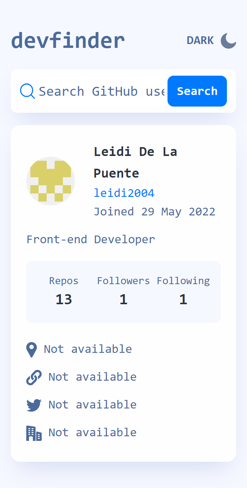
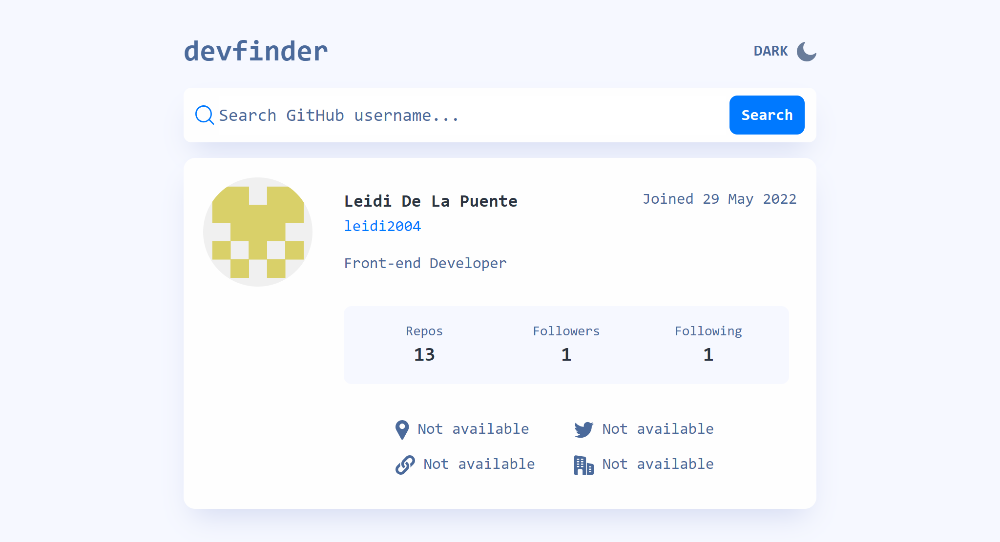

# Frontend Mentor - GitHub user search app solution

This is a solution to the [GitHub user search app challenge on Frontend Mentor](https://www.frontendmentor.io/challenges/github-user-search-app-Q09YOgaH6). Frontend Mentor challenges help you improve your coding skills by building realistic projects.

## Table of contents

- [Overview](#overview)
  - [The challenge](#the-challenge)
  - [Expected behavior](#expected-behaviour)
  - [Screenshot](#screenshot)
  - [Links](#links)
- [My process](#my-process)
  - [Built with](#built-with)
  - [What I learned](#what-i-learned)
- [Author](#author)

## Overview

### The challenge

Users should be able to:

- View the optimal layout for the app depending on their device's screen size
- See hover states for all interactive elements on the page
- Search for GitHub users by their username
- See relevant user information based on their search
- Switch between light and dark themes
- Have the correct color scheme chosen for them based on their computer preferences.
- Persist the prefer theme over the default theme of the device.

The GitHub users API endpoint is `https://api.github.com/users/:username`.

### Expected behavior

- On first load, show the profile information for leidi2004 (my username).
- Display an error message (as shown in the design) if no user is found when a new search is made.
- If a GitHub user's bio is empty, show the text "This profile has no bio".
- If any of the location, website, twitter, or company properties are empty, show the text "Not Available".
- Website, twitter, and company information should all be links to those resources.

### Screenshot





### Links

- Live Site URL: ()

## My process

### Built with

- ReactJs
- TailwindCSS
- Mobile-first workflow
- Axios
- Moments js
- Github API

### What I learned

custom colors in tailwind  
```tailwind
theme: {
    extend: {
      colors: {
        white: {
          100: "#fefefe",
          200: "#f6f8ff",
        },
        github: {
          100: "#60abff",
          200: "#0079ff",
          300: "#4b6a9b",
          400: "#1E2A47",
          500: "#141D2F",
          600: "#2b3442"
        }
      }
    },
  },

```

dark mode

```javascript
//tailwind.config.js
"darkMode": "class",

 const [theme, setTheme] = useState(() => {
    if (localStorage.getItem("theme") !== null) {
      return localStorage.getItem("theme");
    } else {
      if (window.matchMedia("(prefers-color-scheme: dark)").matches) {
        return "dark";
      }
      return "light";
    }
  });

  const handleChangeTheme = () => {
    setTheme((theme) => (theme === "light" ? "dark" : "light"));
  };

  useEffect(() => {
    if (theme === "dark") {
      document.querySelector("html").classList.add("dark");
    } else {
      document.querySelector("html").classList.remove("dark");
    }
  }, [theme]);

    <h2 className="text-3xl font-bold text-github-300 dark:text-white-100">devfinder<h2>

```

## Author
- Frontend Mentor - [@leidi2004](https://www.frontendmentor.io/profile/leididelapuente13)


